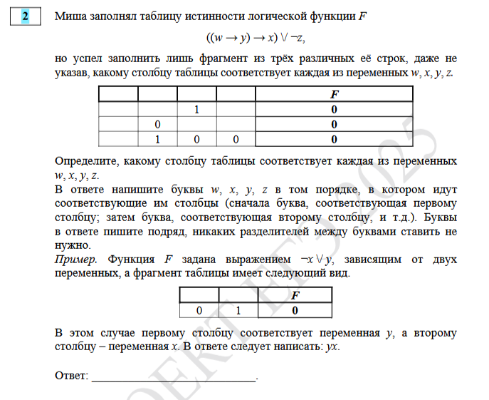

#### Подобрать переменные в таблицу, чтобы расстановка соответствовала логической формуле
Пример задания из демоверсии:

Как решается:
>[Простое задание](https://github.com/BaronVice/Inf2025/blob/main/.2/14688.py)

>[Задание из демоверсии](https://github.com/BaronVice/Inf2025/blob/main/%D0%A0%D0%B0%D0%B7%D0%B1%D0%BE%D1%80%D1%8B_%D0%B2%D0%B0%D1%80%D0%B8%D0%B0%D0%BD%D1%82%D0%BE%D0%B2/%D0%94%D0%B5%D0%BC%D0%BE/.2/2.py)

Логические операции через python:
1) отрицание (инверсия, логическое НЕ) обозначается ¬ (например, ¬a) пишется как ``(not a)``. В скобки выделять обязательно.
2) конъюнкция (логическое умножение, логическое И) обозначается /\ (например, a /\ b) либо & (например, a & b) пишется как ``a and b``.
3) дизъюнкция (логическое сложение, логическое ИЛИ) обозначается \\/ (например, a \\/ b) либо | (например, a | b) пишется как ``a or b``.
4) следование (импликация) обозначается → (например, a → b) пишется как ``a <= b``.
5) тождество обозначается ≡ (например, a ≡ b). Выражение a ≡ b истинно только если значения A и B совпадают (либо они оба истинны, либо они оба ложны) пишется как ``a == b``.
