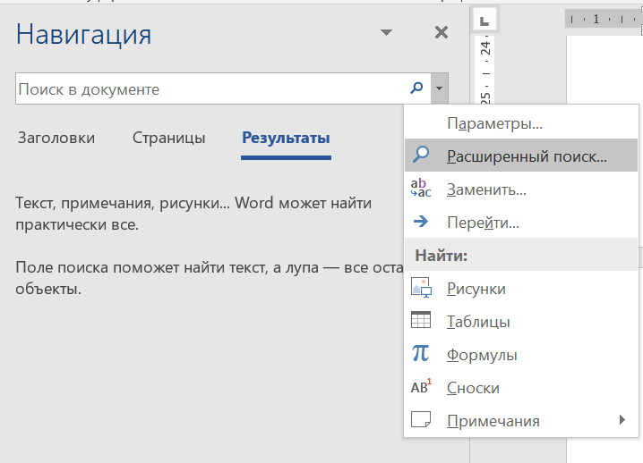
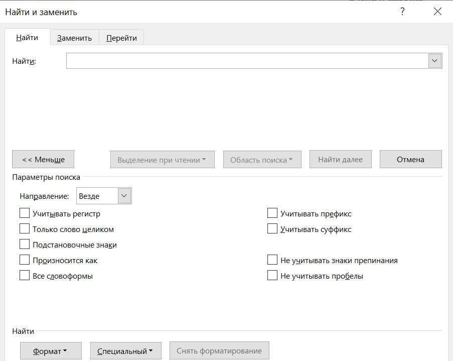
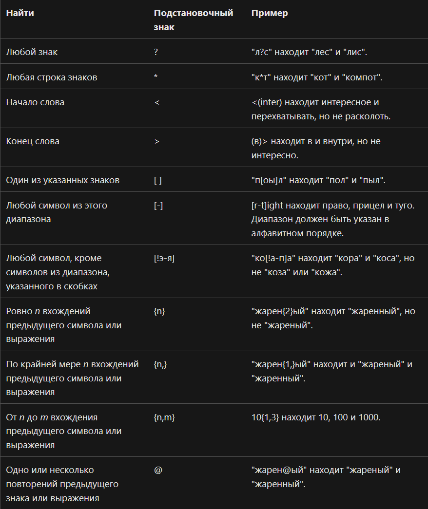

### 10 задание - "Информационный поиск средствами текстового процессора"

Посчитать количество слов в Microsoft Word файле (как правило, в литературном произведении).

В задании могут указыввать критерии поиска:
1) Сколько раз встречается сочетание букв "по" или "По" в составе других слов
2) Сколько раз встречается сочетание букв "по" или "По" как отдельное слово
3) Сколько раз встречается сочетание букв "по" как отдельное слово/в составе других слов
4) Сколько раз встречается ... только в основном тексте
5) Сколько раз встречается ... только в сносках/колонтитулах
6) Сколько раз встречается ... в тексте произведения, включая сноски и колонтитулы
7) Сколько раз слово "картина" встречается в произведении в любом падеже
8) Сколько раз слово встречается в (главах 1, 2, 3)/(первой истории) произведения
9) Встречается в файле
10) Встречается в произведении
...

Решение сводится к тому, что находясь в документе нажимаем Ctrl + F

Переходим в расширенное меню, как показано на рисунке и выбираем расширенный поиск.

Далее нажимаем "Больше >>". Разберем нужные для решения элементы поиска:
1) Поле ввода "Найти" - в него записываем выражение для поиска.
2) Область поиска: предлагает 4 варианта. Текущий фрагмент: поиск слов осуществляется в выделенном фрагменте. Основной документ: везде, кроме сносок и колонтитулов. Колонтитулы - в колонтитулах. Сноски - в сносках.
3) Учитывать регистр - если не отмечено, то при вводе слова "по" в "Найти" будут искаться вхождения "по", "По", "оП", "ОП". Если отмечено, то будут искаться вхождения только "по"
4) Только слово целиком - если не отмечено, то при вводе слова "по" в "Найти" будут искаться как отдельные слова "по", так и как части слов (например "почему"). Если отмечено, то будут искаться вхождения только как отдельного слова.
5) Подстановочные знаки - можно искать не отдельне слова, а паттерны. Например, требуется найти слова, начинающиеся на букву Я или я, длиной не менее трех символов. Тогда в найти запишем следующее: <\[Яя\]\[а-яА-ЯёЁ\]{2;}.

Разборы заданий, которые покрывают большинство критериев поиска:
1) [Из демоверсии 2025](https://github.com/BaronVice/Inf2025/blob/main/10/demo.py)
2) [Задание про то, что аннотация не относится к тексту произведения](https://github.com/BaronVice/Inf2025/blob/main/10/33182.py)
3) [Подстановочные знаки 1](https://github.com/BaronVice/Inf2025/blob/main/10/72568.py)
4) [Подстановочные знаки 2](https://github.com/BaronVice/Inf2025/blob/main/10/68243.py)

Табличка с подстановочными знаками (небольшое замечание: в некоторых версиях Word в написании количества вхождений {n,m} вместо "," используется ";").
