### Задание про рисование прямоугольников в excel

Пусть есть список задач: проснуться, покушать, посмотреть смешные видео, одеться, взять нужные вещи, пойти на улицу.

Они могут выполняться последовательно: проснуться -> покушать -> посмотреть смешные видео -> одеться -> взять нужные вещи -> пойти на улицу

А могут выполняться параллельно:
- Покушать и посмотреть смешные видео (но только после того как проснулись)
- Одеться и взять нужные вещи (но только после того как покушали и посмотрели смешные видео)
- Как оделись и взяли нужные вещи можно выходить на улицу

Задачи можно откладывать на потом, чтобы делать все в последний момент (об этом в другой раз).

22 задание на построение цепочки процессов (они же в примере выше - задачи).
Даются условия выполнения процессов. Для них надо найти ответ.

Возьмем такую задачу (Досрочная волна 2025):

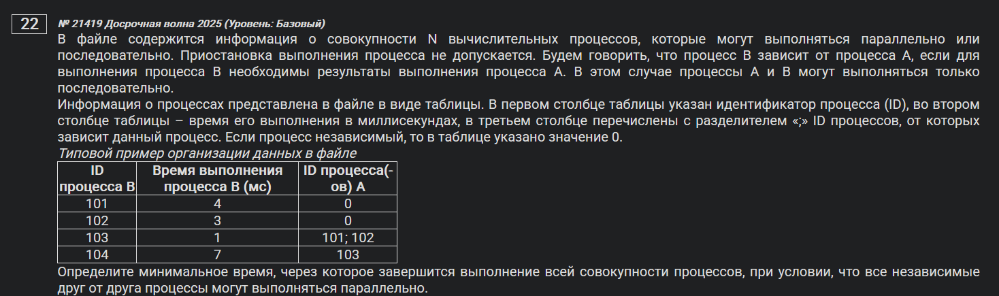

Содержимое Excel файла (сам файл в этой же папке):

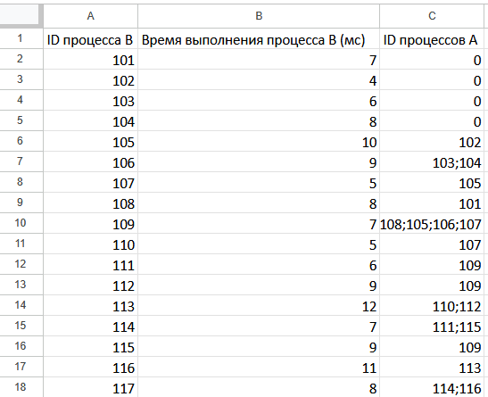

Теперь надо нарисовать процессы:
- Пусть одна ячейка - одна секунда выполнения
- Процессы будут иметь свой цвет
- Процессы выстраиваются исходя из зависимых (процесс B зависит от процесса A - процесс B будет стоять за процессом A)

Для первых четырех получается следующее:

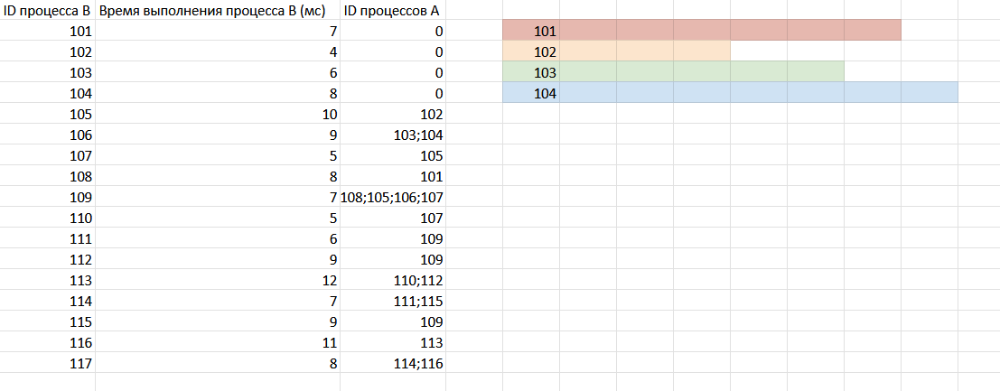

Первые четыре процесса ялвяются начальными. К ним будут добавляться зависимые процессы. Поэтому для удобства выстрою следующим образом:

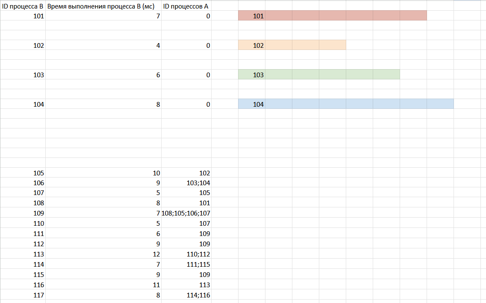

Далее к заплонению остальных процессов...

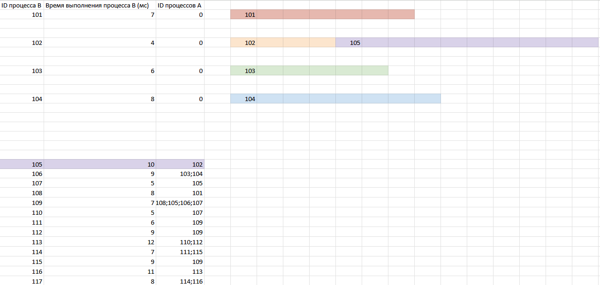

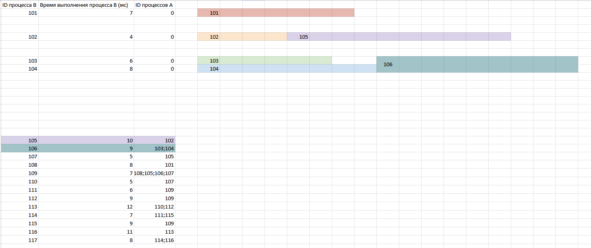

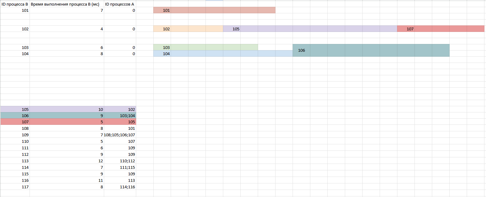

109 не может начаться без завершения 108, 105, 106 и 107. Но 107 не может начаться пока не завершиться 105. Из чего можно упростить до 109 не может начаться без завершения 108, 106 и 107.

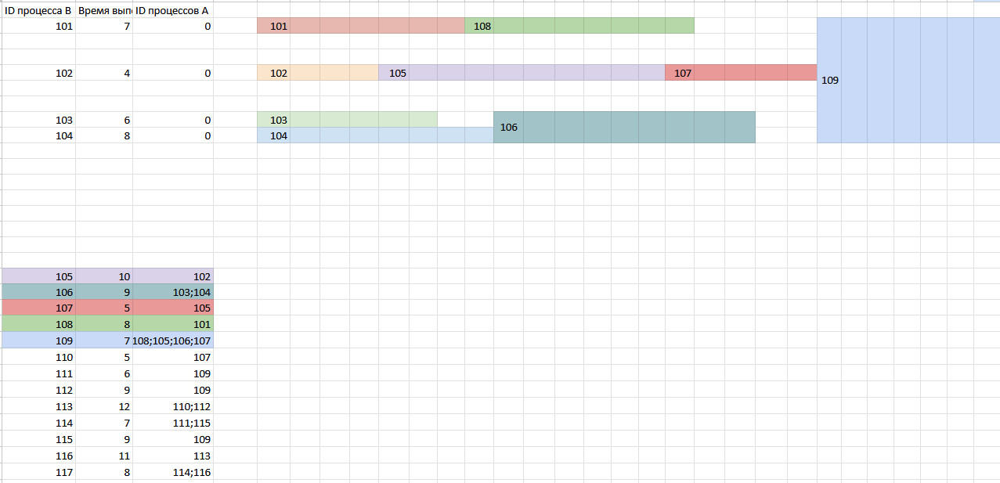

Понимаю, что 110 после 107 сложно нарисовать, поэтому поменяю местами последовательности 102, 105, 107 и 103, 104, 106:

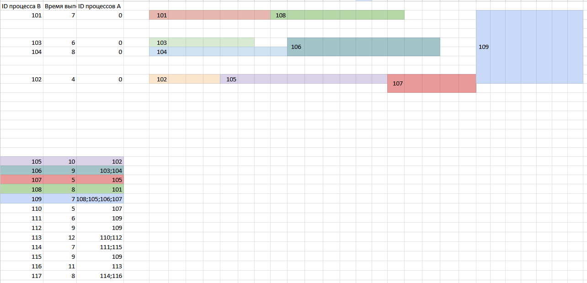

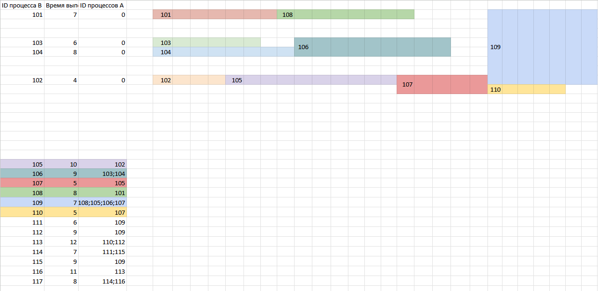

Нарисую все, которые идут сразу после 109:

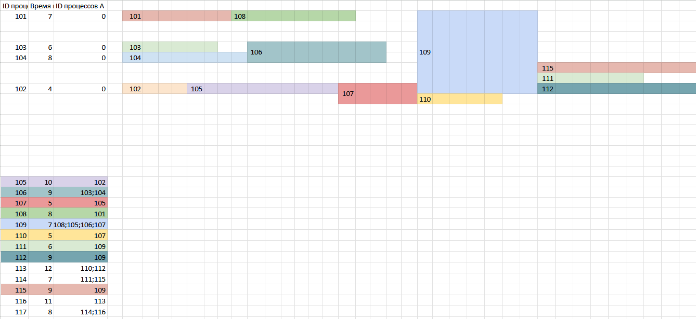

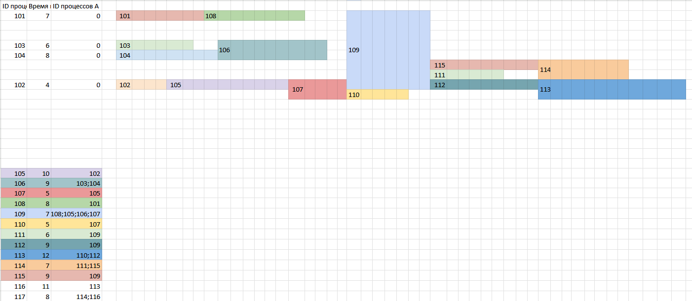

В результате получается:

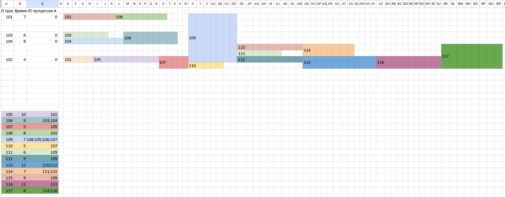

*Определите минимальное время, через которое завершится выполнение всей совокупности процессов, при условии, что все независимые друг от друга процессы могут выполняться параллельно.*

И как раз нарисовали так, что все независимые друг от друга процессы выполняются параллельно (например 111, 112, 115 выполняются параллельно после 109). Тогда ответ - количество столбцов начиная от столбца E.

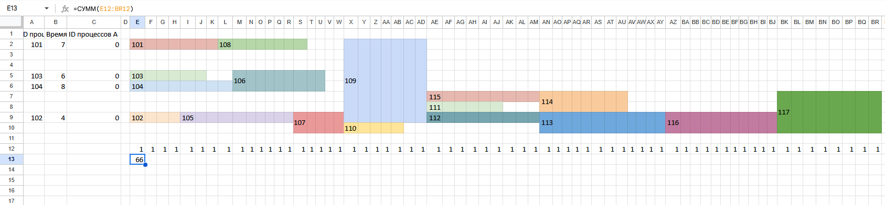

### Не во всех заданиях нужно рисовать иерархию процессов
Например такое задание:

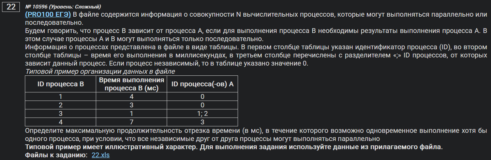

*Определите максимальную продолжительность отрезка времени (в мс), в течение которого возможно одновременное выполнение хотя бы одного процесса, при условии, что все независимые друг от друга процессы могут выполняться параллельно.*

Максимальное время выполнения, в течение которого выполняется хотя бы один процесс = сумма времени всех процессов (для достижения максимального времени выполнения забываем про существование параллельного выполнения, все процессы будут выполняться последовательно).

Или следующее:
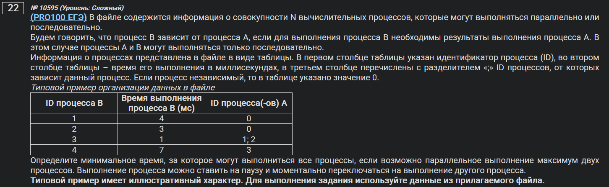

*Определите минимальное время, за которое могут выполниться все процессы, если возможно параллельное выполнение максимум двух процессов. Выполнение процесса можно ставить на паузу и моментально переключаться на выполнение другого процесса.*

- Максимум процоцессов, которое может выполняться параллельно - 2 штуки.
- Выполнение процесса можно ставить на паузу и моментально переключаться на выполнение другого процесса.

Если сумма времени выполнения всех процессов последовательно = X секунд, то время выполнения всех процессов при условиях выше = X/2.
