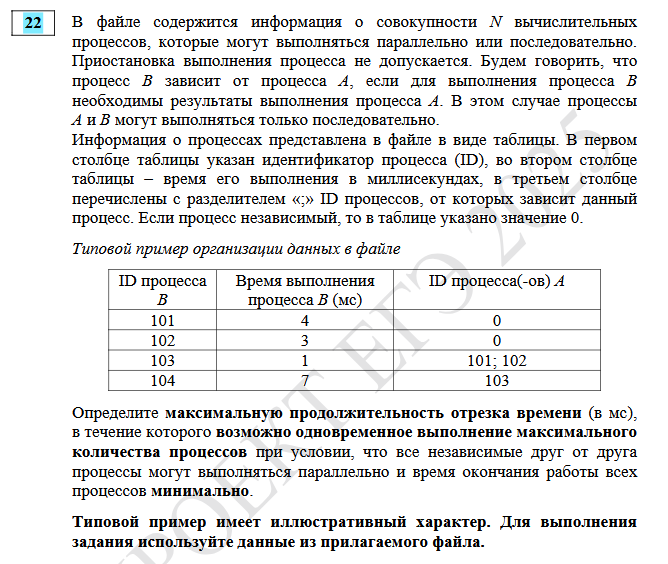
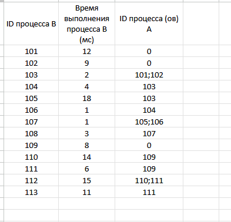
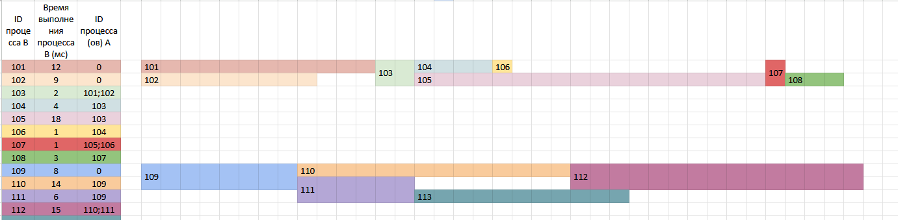
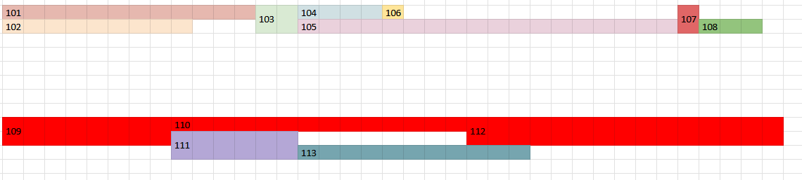
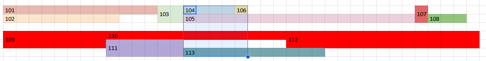
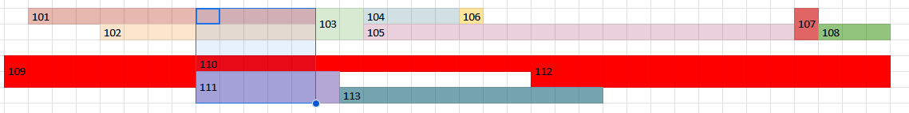

### Теперь задание, где процессы предстоит двигать

Для разбора будет взято 22 из демоверсии.

*Определите максимальную продолжительность отрезка времени (в мс), в течение которого возможно одновременное выполнение максимального количества процессов при условии, что все независимые друг от друга процессы могут выполняться параллельно и время окончания работы всех процессов минимально.*

Файл в этой папке. Для начала откроем его.

Нарисуем цепочку процессов.

- Все процессы можно двигать.
- Однако в задании есть важное условие: *время окончания работы всех процессов минимально*
- Назовем веткой последовательность процессов от начального до конечного.
- Их будет две штуки: от 101 и 102 до 108, от 109 до 112.
- Самая длинная по времени ветка - от 109 до 112.
- Если время окончания работы всех процессов должно быть минимально, то начало и конец самой длинной ветки сдвигать нельзя (можно двигать процессы внутри нее, если они не изменят время окончания ветки).
- Нельзя сдвигать процессы остальных веток до времени начала и за время окончания самой длинной ветки

Зафиксирую процессы, которые нельзя двигать:

- Максимальное количество процессов в первой ветке, которые могут выполняться параллельно = 2
- Максимальное количество процессов во второй ветке, которые могут выполняться параллельно = 2

Из чего максимальное количество процессов, которые могут выполняться параллельно = 2 + 2 = 4.

Подбираем (да, это плохо, но так решается задание) первую ветку ко второй так, чтобы выполнялось 4 процесса параллельно:

Ответ 1: 5 секунд

Ответ 2: 5 секунд

И на этом можно закончить (больше 5 не получим).

Ответ: 5

