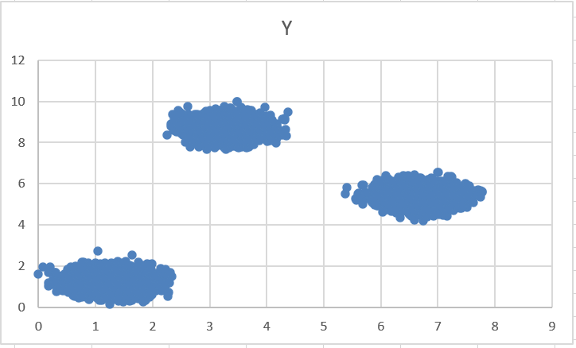
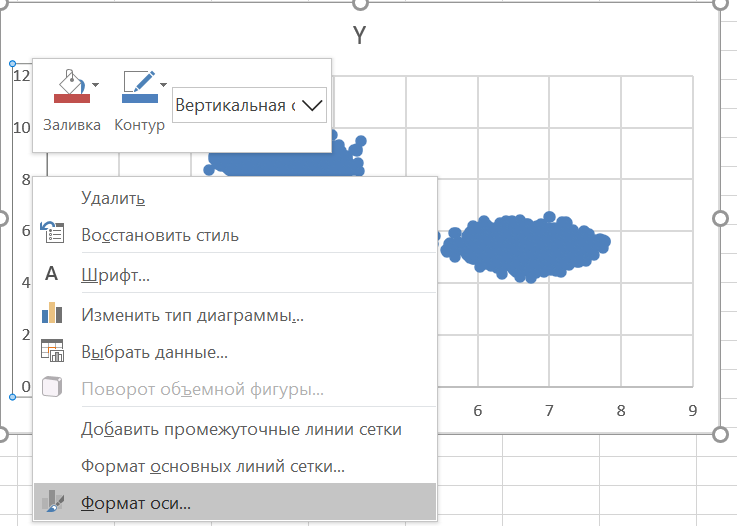

#### 27 задание - анализ данных
Состоит из трех частей:
1) Отобразить данные в Excel
2) Рисуем треугольники
3) Напишем код

Как задание сформулировано...

Есть набор точек, сгруппированных на несколько куч (кластеров). Для каждого кластера определить точку центроид/край/что-то_другое. Исходя из координат таких точек вывести ответ.

Задание из демоверсии:

Откроем Excel файл для пункта А и отобразим данные. Для этого нужно выделить столбцы A и B, перейти в меню "Вставка" и выбрать точечную диаграмму:

Появится следующая диаграмма:

Можно заметить, что точки разделены на две группы (кластеры). Как их можно разделить исползуя оси X и Y?

Вариант 1:

Вариант 2:

Возьмем второй вариант - разделение по Y. Тогда все точки по Y меньше чем 3 относятся к первому кластеру, иначе ко второму.

Запомним это, откроем файл Б и снова построим точечную диаграмму.

Если получилось так, что по одной из осей вас не устраивает шаг деления, то его можно поменять.

Так у меня по оси Y шаг 2, но хочу поменять на 1. Для этого нажмем на деления:

Правая кнопка мыши. Формат оси:

Здесь можно много чего настроить. Для смены шага деления нужно поменять значение в "Деления" "Основные":

В результате смены с 2.0 на 1 (можно выбрать и меньше, например 0.5) получается:

По заданию у файла Б 3 кластера. Разделить их можно опять же по Y:

Все точки по Y меньше 3 - первый кластер, между 3 и 7 - второй кластер, больше 7 - третий.

Зная это можно переходить к написанию кода.
1) [Файл А](https://github.com/BaronVice/Inf2025/tree/main/_27/demo/demoA.py)
2) [Файл Б](https://github.com/BaronVice/Inf2025/blob/main/_27/demo/demoB.py)

#### Дополнения
Есть задания с "аномалиями" - это точки, лежащие вне кластеров. Эти выбросы данных по заданию, как правило, просят не причислять к кластерам.
Пусть есть следующие данные:

Для начала увеличим шаг делений:

Иногда линиями не поделишь -> поделим области прямоугольниками:

Или вот еще пример:

