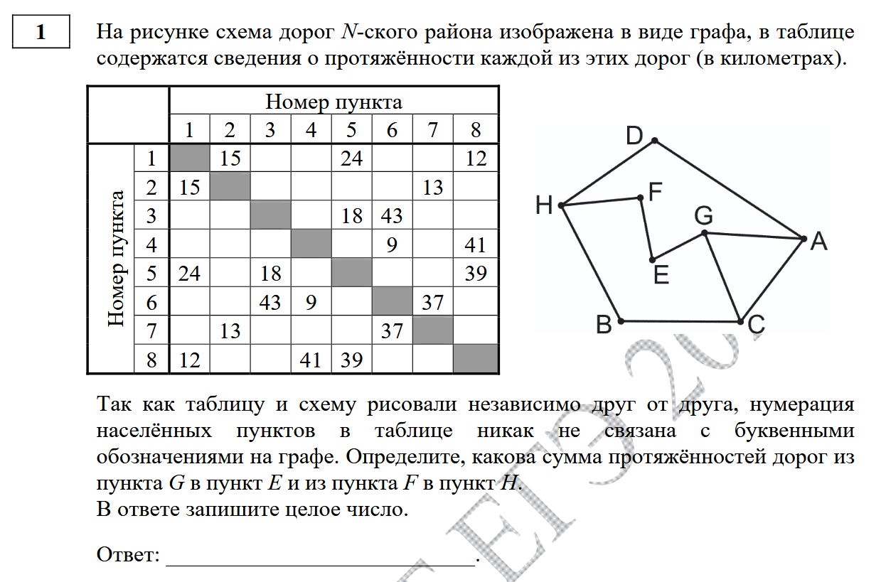
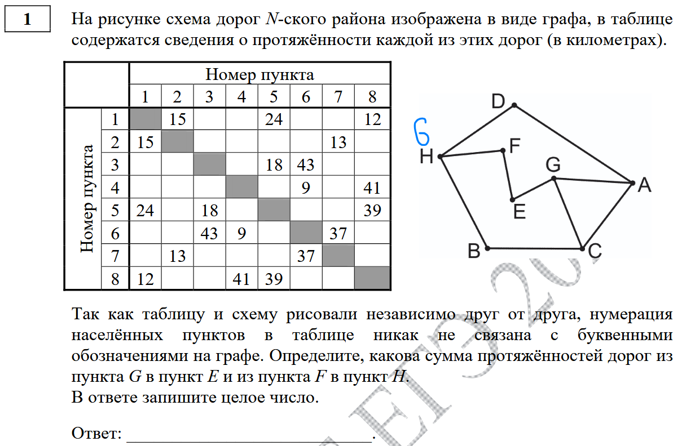
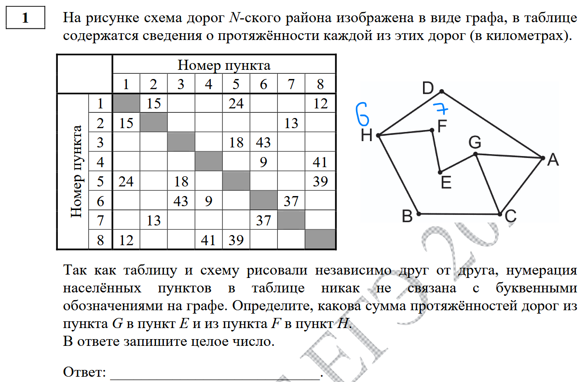
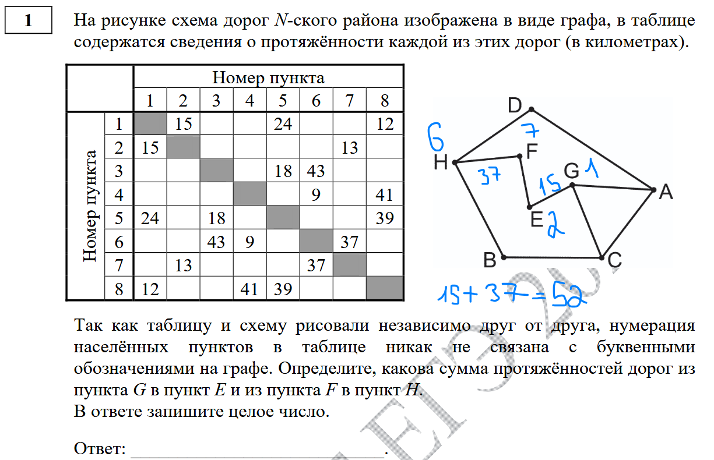

H является уникальной - имеет 3 соседа, у каждого из которых 2 дороги. По таблице рассматриваем пункты с 3 дорогами и ищем такой, чтобы у каждого соседа было 2 дороги. H - 6

Соседи H: D, F, B. Оставшиеся дороги D и B ведут в пункты с 3 дорогами (A и C). Оставшаяся дорога F ведет в пункт с 2 дорогами (E). Из соседей H (3, 4, 7) найдем F. F - 7.

Из чего E - 2, G - 1. Ответ: 15 (G-E) + 37 (F-H) = 52

