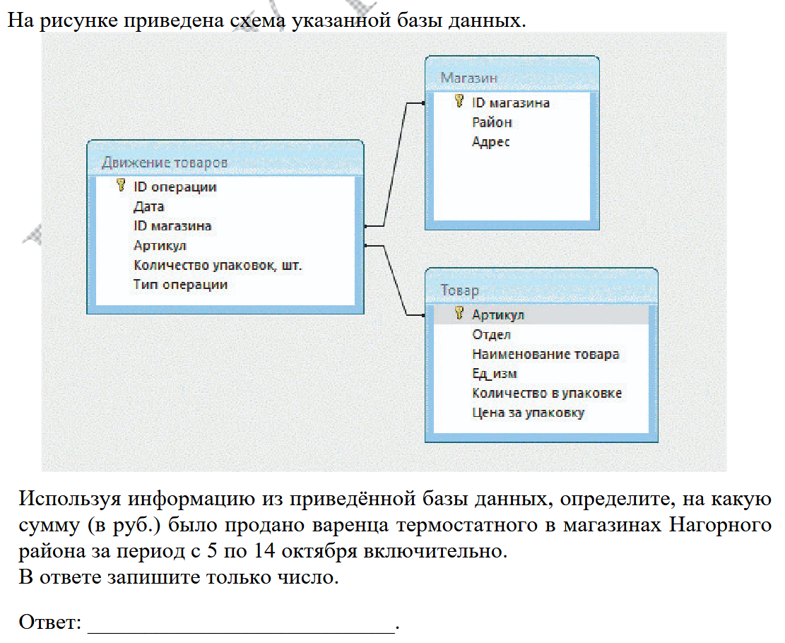
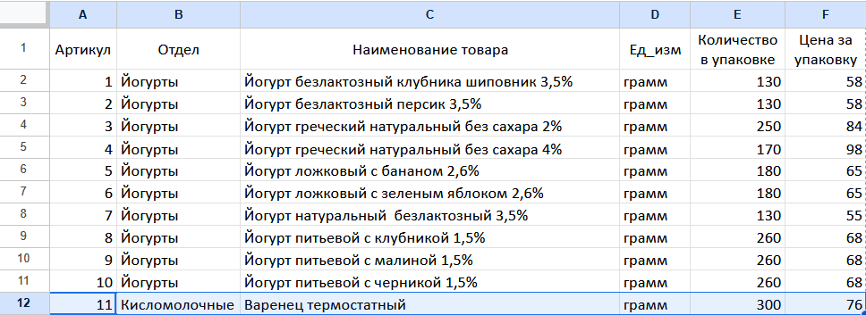
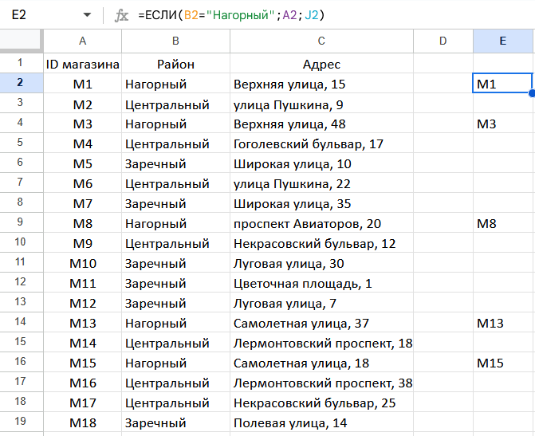
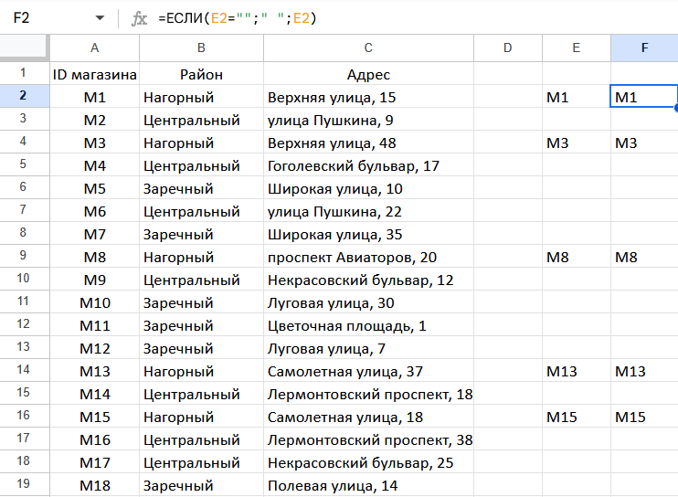
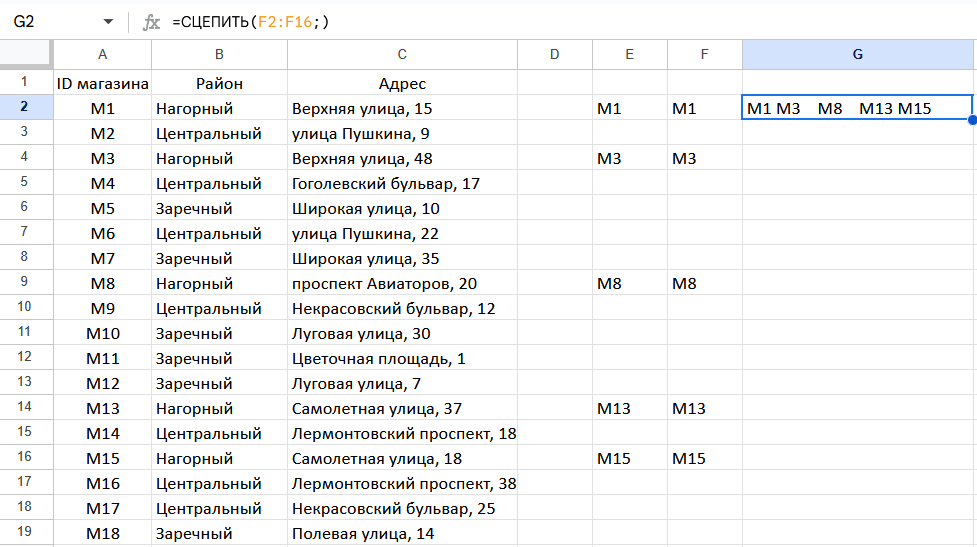
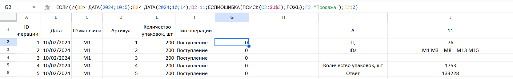
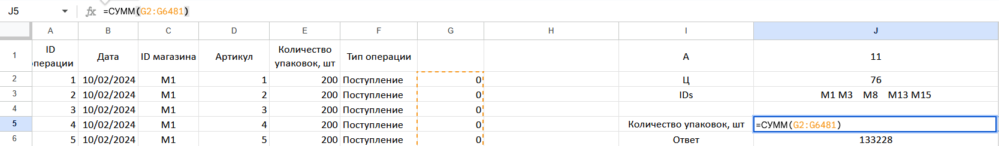

1) Найти артикул варенца термостатного в таблице "Товар" (пусть A), запомнить цену за упаковку (пусть Ц)
2) Найти ID магазинов в таблице "Магазин", у которых район Нагорный (пусть массив IDs)
3) Посчитать сумму упаковок в таблице "Движение товаров", что "Дата" с 5 по 14 октября включительно, "ID Магазина" в IDs, Артикул = А, Тип операции "Продажа". Сумму умножить на Ц

А = 11, Ц = 76

Что в формуле:
1) B2>=ДАТА(2024;10;5);B2<=ДАТА(2024;10;14) - "Дата" с 5 по 14 октября включительно
2) D2=11 - Артикул = А
3) ЕСЛИОШИБКА(ПОИСК(C2;$J$3);ЛОЖЬ) - "ID Магазина" в IDs. ПОИСК - поиск подстроки в строке, вернет ИСТИНА если есть, #VALUEERROR если нет -> обработка ошибки через ЕСЛИОШИБКА (если ошибка, то 0)
4) F2="Продажа" - Тип операции "Продажа"
5) ЕСЛИ(И(...); E2, 0) - Если все, что внутри И(...) ИСТИНА, то E2 (количество упаковок), иначе 0

