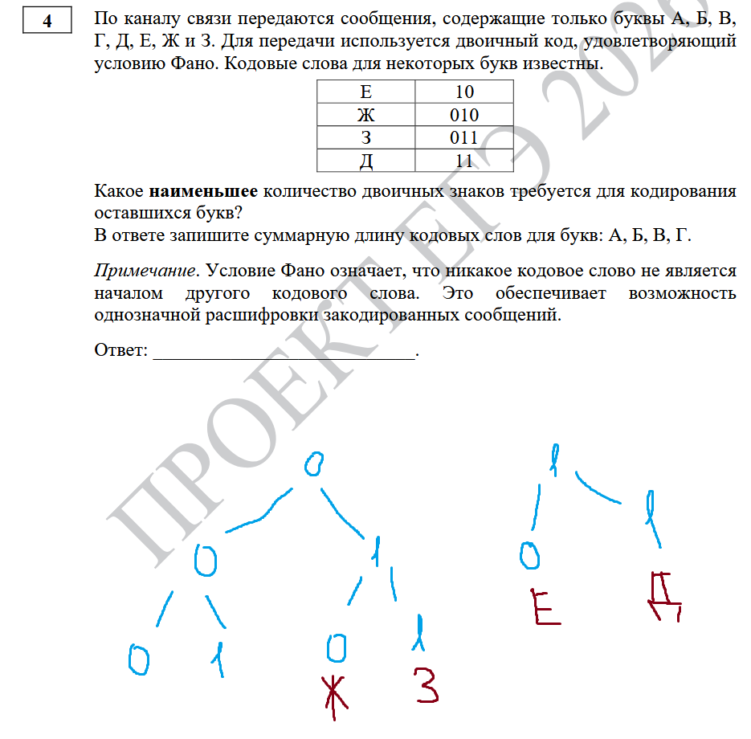
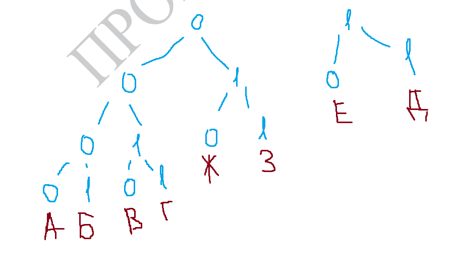

Можно расписать из 00 слова длины 4 (0000, 0001, 0010, 0011). Суммарная длина 16

Или одной букве длину 3, остальным 5. Суммарная длина 18

Это простое задание, в нем второй вариант можно было не рассматривать. В заданиях про короткую длину слова нужно рассматривать все варианты
