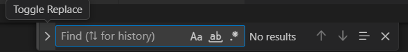
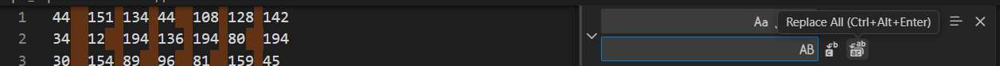

1) Открыть .ods файл, в нем Ctrl+A Ctrl+C
2) Создать .txt файл, туда Ctrl+V, заменить все символы Tab на пробел:

Ctrl+F, жмяк на стрелку слева

Первое - что заменить (заменить надо Tab, для этого можно скопировать любой символ между числами), второе - на что заменить (пробел). Replace All

Сохранить изменения в .txt файле (Ctrl+S). Далее в solution.py
