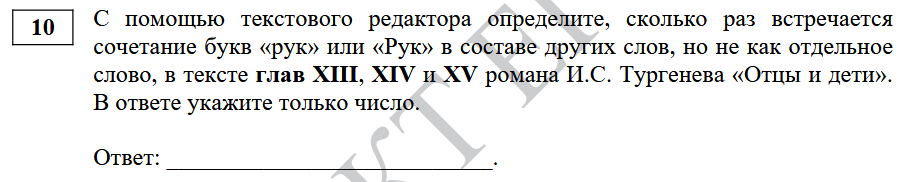

1) Перенести главы XIII, XIV, XV в отдельный .odt/.word файл (или удалить все, кроме этих глав)
2) Ctrl+F количество всех "рук". В параметрах поиска без "Учитывать регистр"
3) Ctrl+F количество всех "рук". В параметрах поиска без "Учитывать регистр", с "Только слово целиком"

Разность результатов 2 и 3 будет ответом: 13
