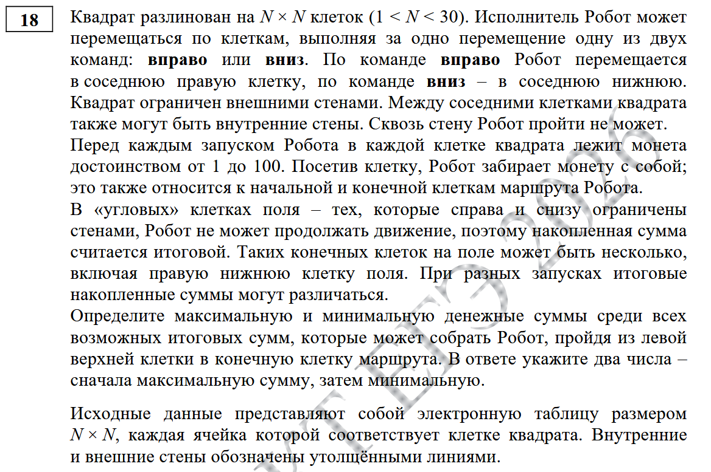

Внизу исходной таблицы создается таблица, на которой будет считаться ответ:
1) Верхняя левая ячейка (с нее робот начинает движение) содержит в себе значение из исходной таблицы.

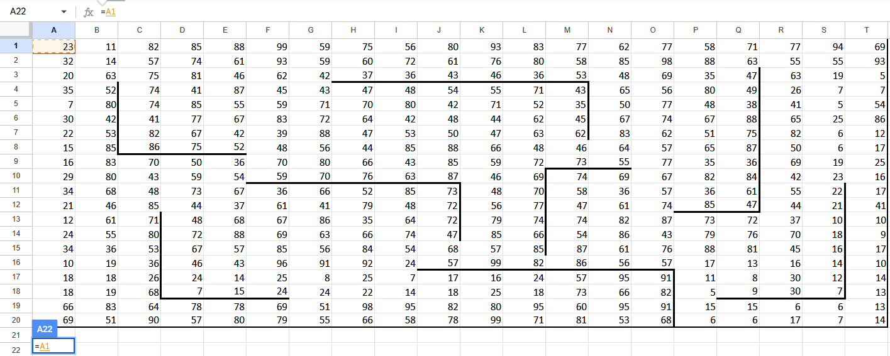

2) Для остальных ячеек первого столбца = значение из исходной таблицы + значение из новой сверху (робот может прийти в нее только сверху используя команду "вниз"). Растягиваем формулу до соответствия количеству строк к исходной таблице.

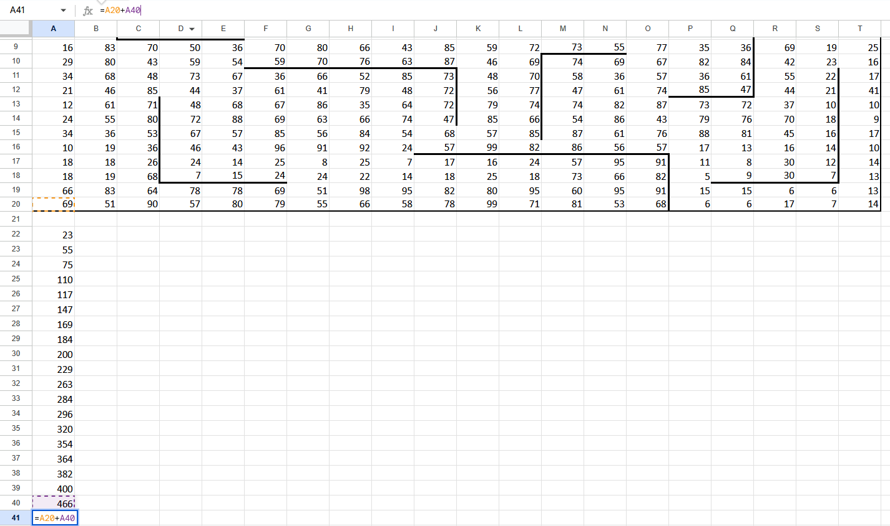

3) Для остальных ячеек первой строки = значение из исходной таблицы + значение из новой слева (робот может прийти в нее только слева используя команду "вправо"). Растягиваем формулу до соответствия количеству строк к исходной таблице.

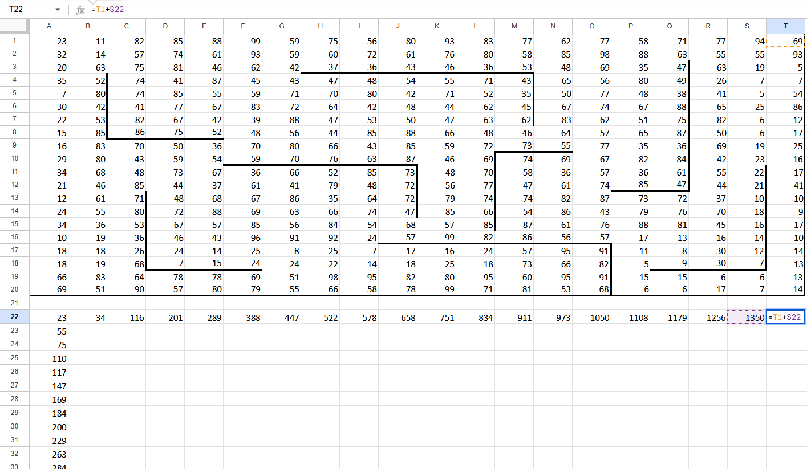

4) Для оставшихся клеток, начиная со второй_строки-второго_столбца = значение из исходной таблицы + из новой максимум(значение сверху, значение слева). По заданию нужно определить максимум и минимум. Сейчас поиск максимума. Как считать минимум будет в конце.

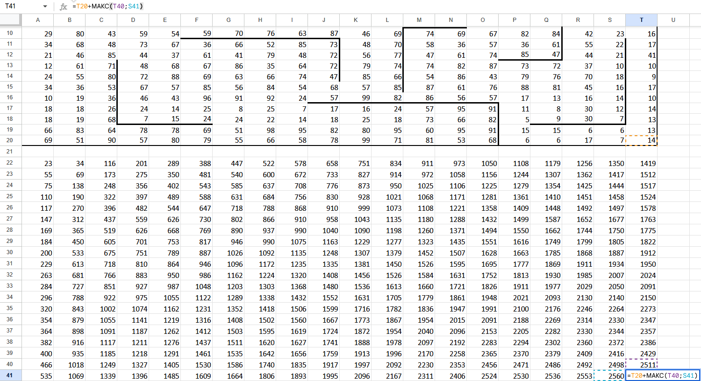

Теперь надо перенести стены из исходной таблицы на новую. Для этого надо:
1) Выделить исходную таблицу.
2) Нажать на кнопку "Копировать форматирование" (значок кисточки, обычно расположена на верхней панели слева).
3) Выделить новую таблицу.

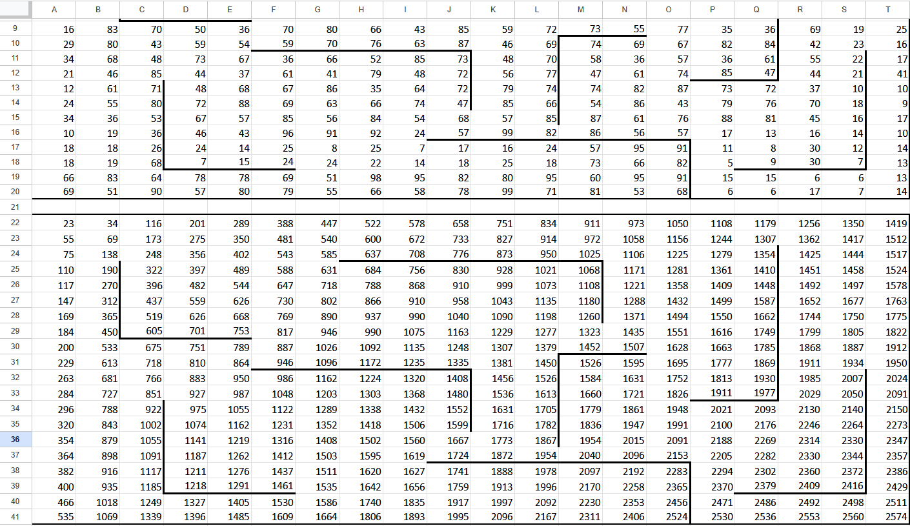

В «угловых» клетках поля – тех, которые справа и снизу ограничены стенами, Робот не может продолжать движение, поэтому накопленная сумма считается итоговой. Таких конечных клеток на поле может быть несколько, включая правую нижнюю клетку поля. При разных запусках итоговые накопленные суммы могут различаться.

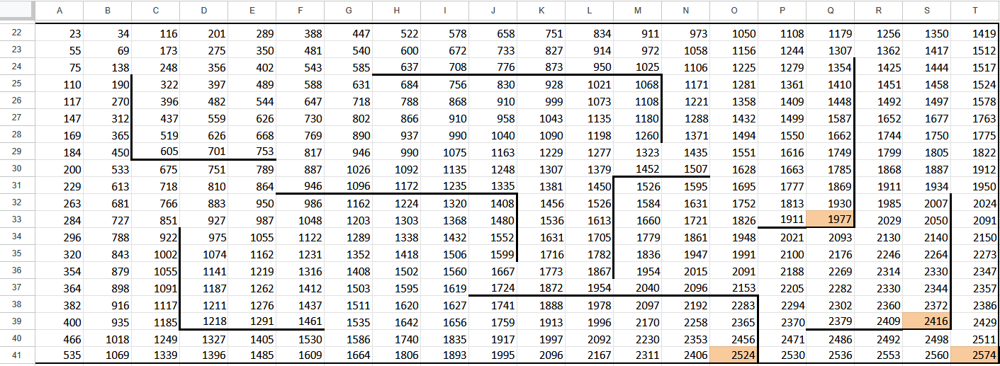

Осталось изменить значения ячеек с учетом стен:
1) Сперва следует удалить ячейки, в которые робот не может попасть. В эти ячейки робот не зайдет, поскольку они окружены стенами слева и справа. Используя действия "вправо" и "вниз" в них не попасть.

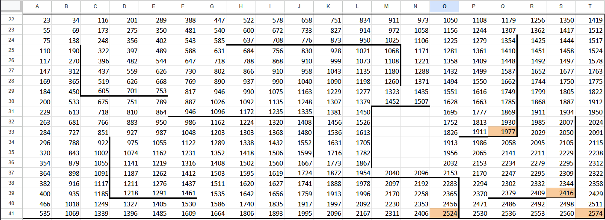

2) Если сверху стена, то в ячейку нельзя прийти используя команду "вниз". Для таких ячеек формула = значение из исходной таблицы + значение из новой слева. (Чтобы не переписывать формулу для каждой стены: Ctrl+C переписанной формулы, Ctrl+V на ячейку и растягивание вдоль стены, и так для каждой стены).

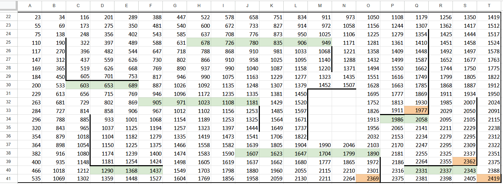

3) Если слева стена, то в ячейку нельзя прийти используя команду "вправо". Для таких ячеек формула = значение из исходной таблицы + значение из новой сверху.

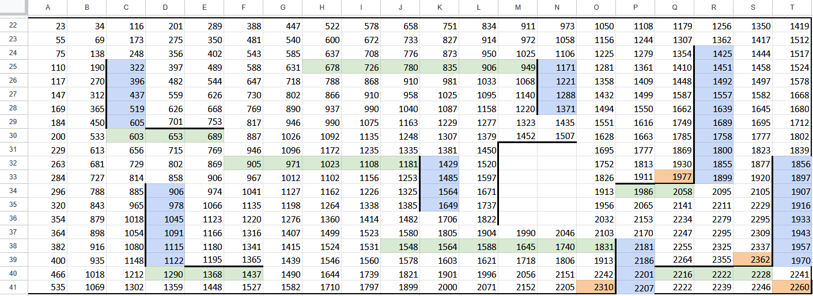

Максимум = 2362. Чтобы найти ответ для минимума, МАКС заменить на МИН (Ctrl+H, замена МАКС на МИН, поиск по формулам):

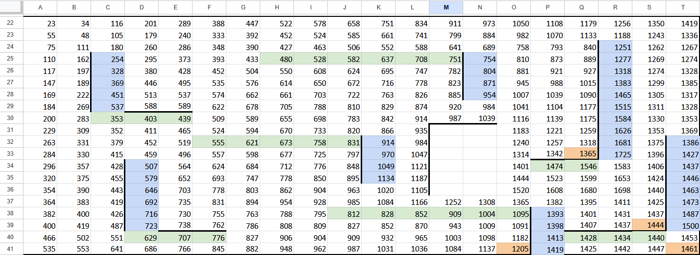

Минимум = 1205. Ответ: 2362 1205
