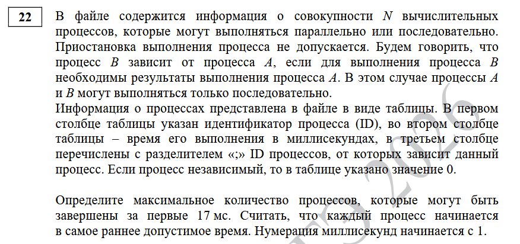
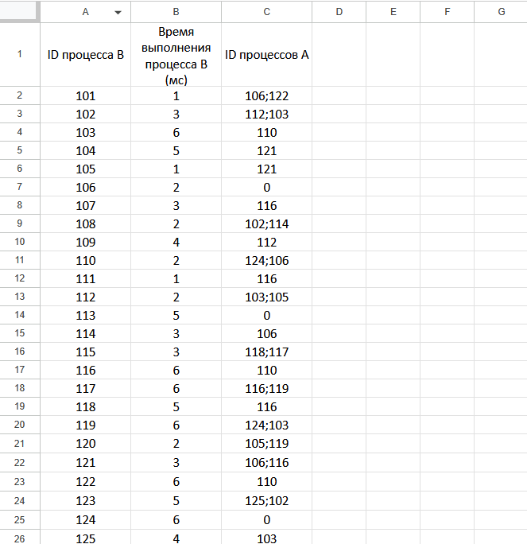
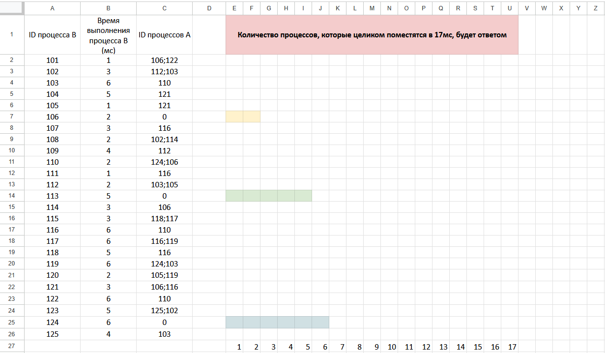
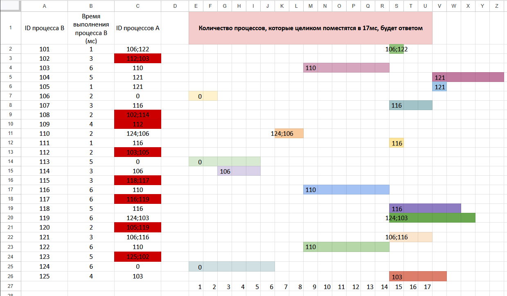
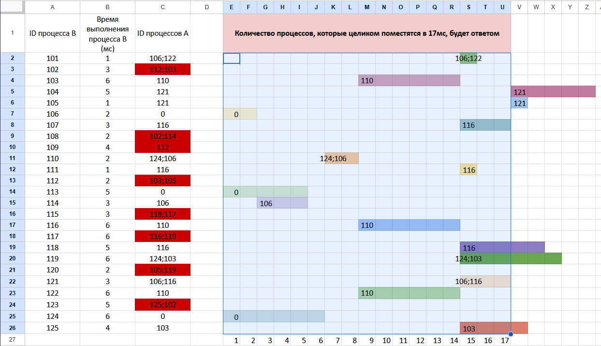

Рисуем дерево процессов так, что процесс начинаются сразу после окончания от которых зависит

Некоторые процессы не рисую т.к. они выходят за 17 мс.

Количество процессов, которые могут быть завершены за первые 17 мс = 12

