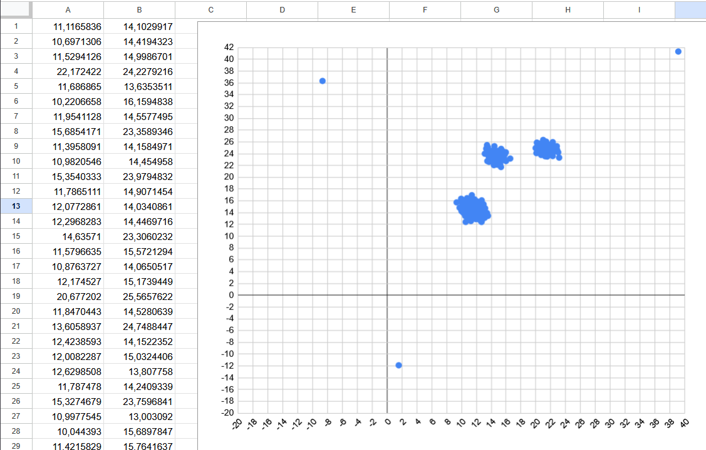

Для начала в файле сделать замену всех пробелов на Tab. Ctrl+A Ctrl+C. В Excel:

1) Ctrl + V
2) Выделение столбцов
3) Вставка диаграммы

Разделение кластеров:
0) Если X не в [6; 26], то аномалия 
1) Если Y меньше 18
2) Иначе если X меньше 18
3) Иначе третий кластер
