#### 80% заданий - вставить формулу и растянуть ее (довольно просто)
#### Но это задание из 20% - вставить формулу и растянуть ее, затем в некоторых местах немного поменять ее (посложнее, но не сильно)

Так изначально выглядит файл:
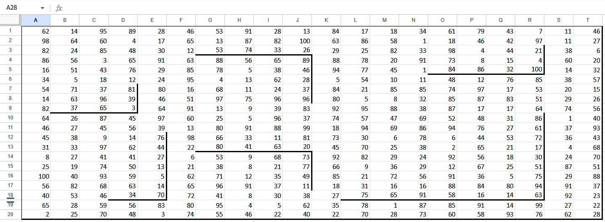

Робот может передвигаться вправо или вниз.
Как можно прийти в клетку B2?
Из верхней или левой: B1 или A2.
Чтобы набрать максимальную сумму, то для B2 ответ будет следующий: само значение B2 + максимум между посчитанными B1 и A2.
Исключения:
1) Первая строка, первый столбец - начальная позиция: само значение.
2) Остальные значения первой строки - значений сверху нет: само значение + значение слева.
3) Остальные значения первого столбца - значений слева нет: само значение + значение сверху.
4) Значения у стен - их рассмотрим позже.

Тогда создадим таблицу с посчитанными значениями. Начнем заполнять для B2 в клетке B23.
Формула для B2... =B2+МАКС(A23;B22)
растянем до нижнего правого угла (Т41).
Получим следующее:
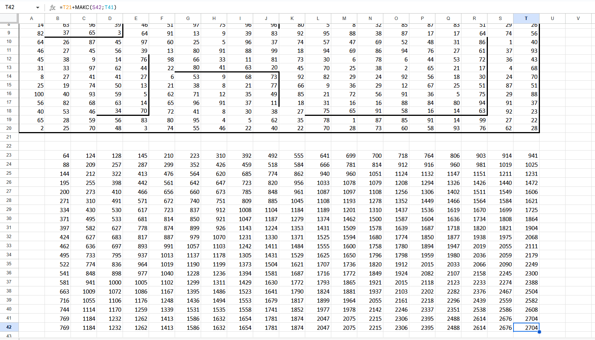

Заполним для исключений:
1) Для A22 =A1.
2) Для B22 вставим... =B1 + A22 ...и растянем до конца строки (T22).
3) Для A23 вставим... =A2 + A22 ...и растянем до конца столбца (A41).

В результате вся таблица будет заполнена:
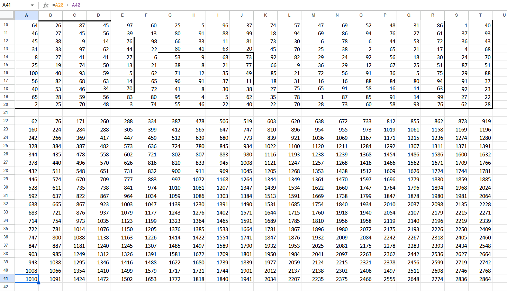

Теперь предстоит обработать стенки
Выделяем исходную таблицу и нажимаем на "Копировать форматирование" (на верхней панели инструментов):
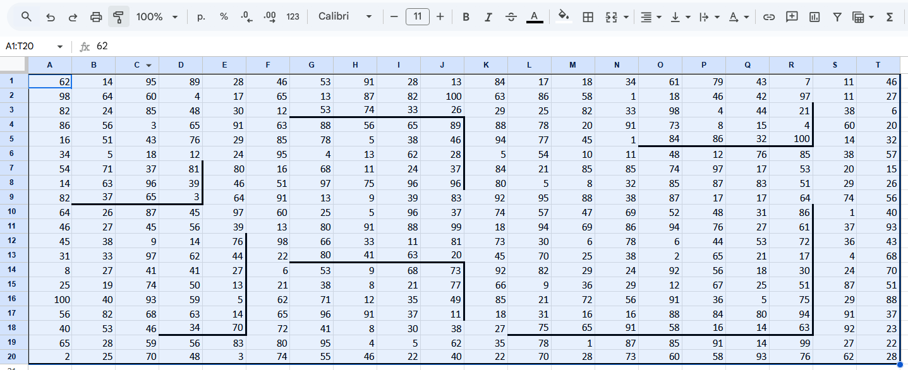
После выделяем таблицу с посчитанными значениями:
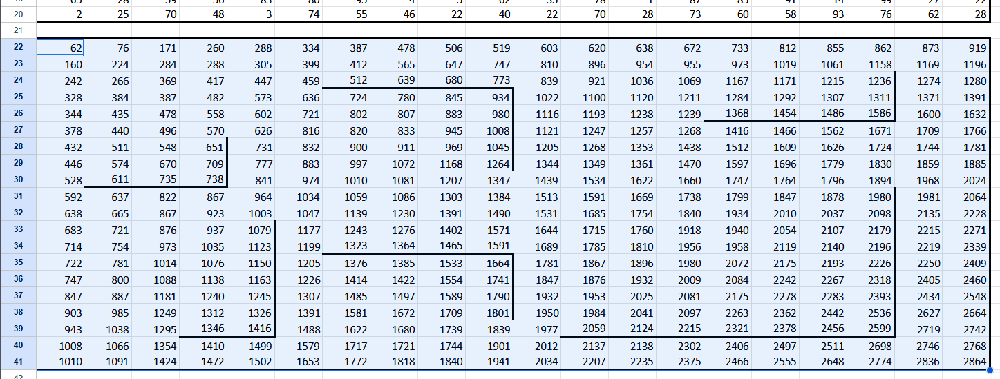
Стенки перенеслись.
4) В клетку, у которой слева стенка, прийти можно только сверху. В клетку, у которой сверху стенка, прийти можно только слева.
Пример: возьмем клетку E28.
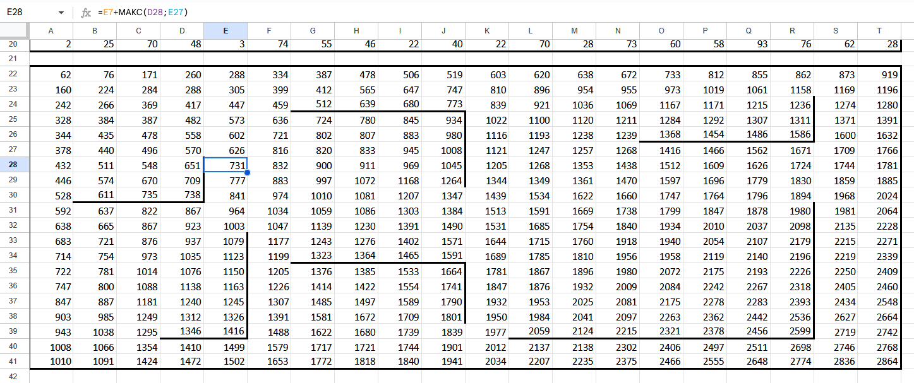
Слева от нее стоит стенка -> брать значение слева (D28) нельзя.
Тогда формула меняется на:
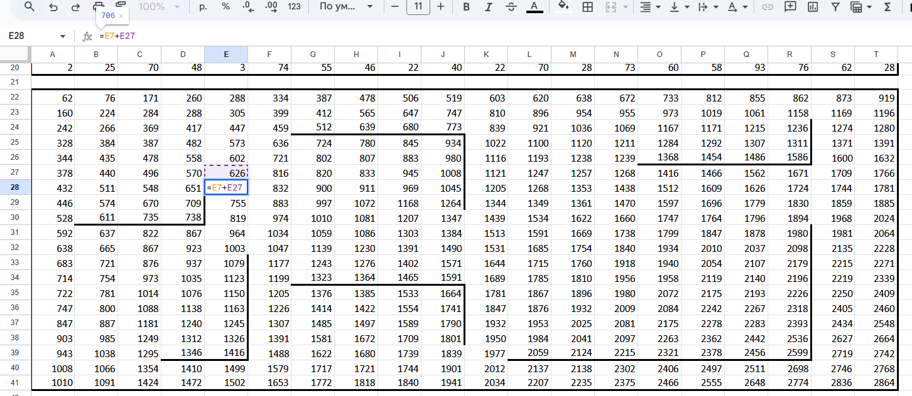
И протягиваем еще для двух нижних значений, поскольку слева от них тоже стенка.
Аналогичным образом поменяем для B31 со стенкой сверху: но не берем значение сверху и протягиваем на два вправо.
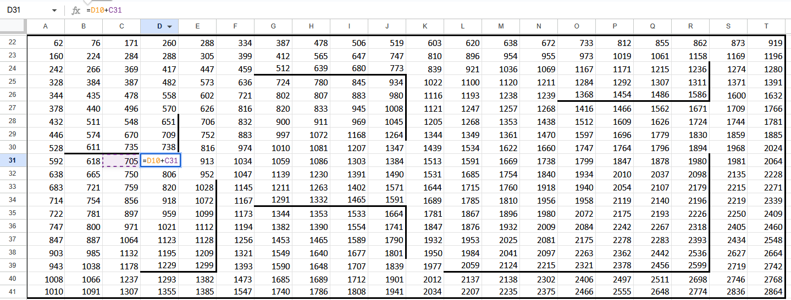
И применяем эти изменения для всех клеток, у которых слева или сверху стенка.
Приходим к:
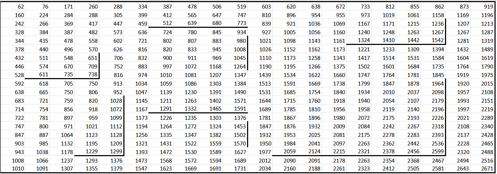
Робот идет из верхней левой в правую нижнюю. По заданию он может закончить в любой "угловой" клетке,: ограниченной стенами справа и снизу. Выделю конечные клетки зеленым цветом:
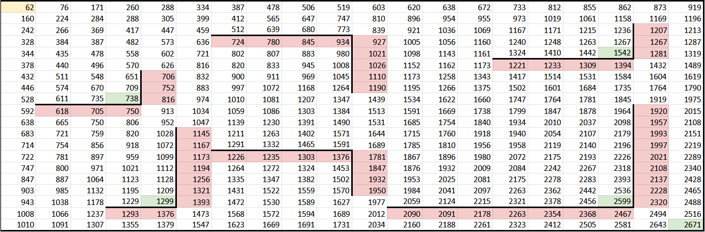
Ответ для максимума: 2671
Чтобы найти ответ для минимума, вместо МАКС используем МИН (Ctrl+H, замена МАКС на МИН, поиск по формулам):

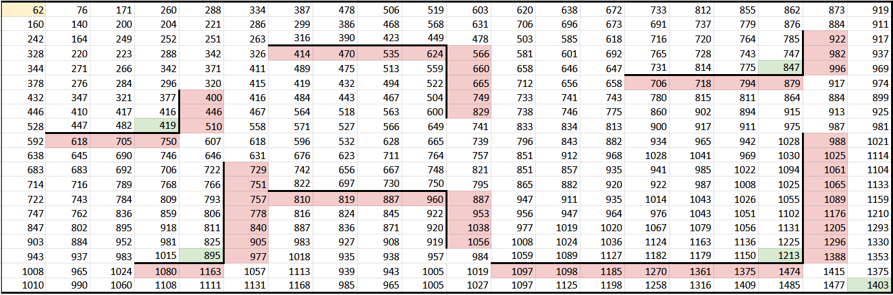
Ответ для минимума: 419
