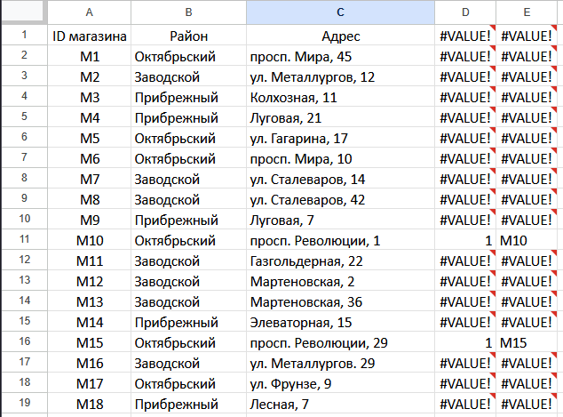
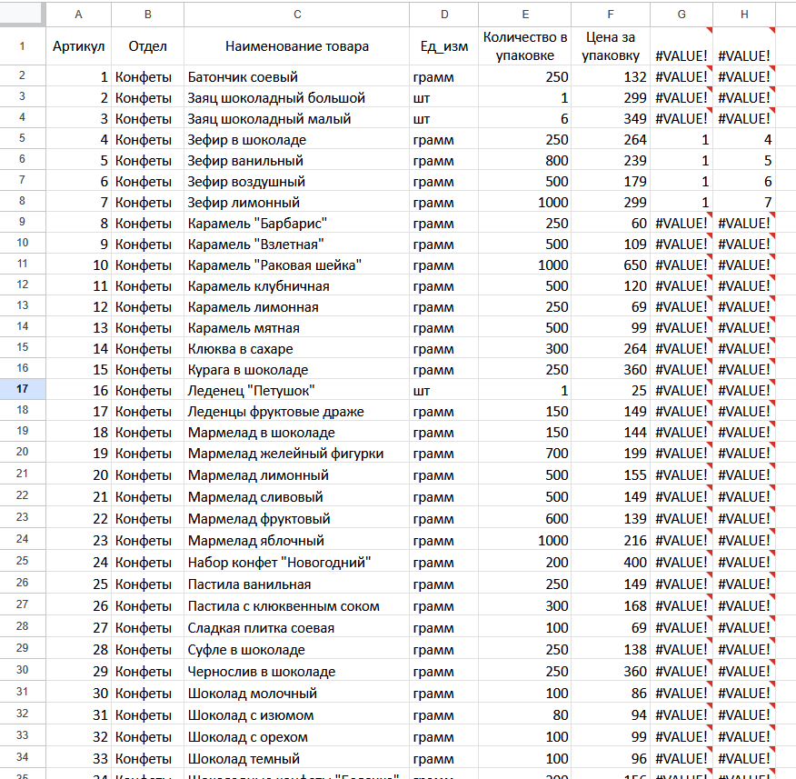

#### Задание
Используя информацию из приведённой базы данных, определите общую
массу (в кг) всех видов зефира, полученных магазинами, расположенными
на проспекте Революции, за период со 2 по 10 августа включительно.
В ответе запишите только число.

#### Решение
Есть следующие таблицы:
1) "Движение товаров", из которой возьмем
    1. даты (за период со 2 по 10 августа включительно)
    2. тип операции (полученных магазинами)
2) "Магазин", из которой возьмем
    1. адрес (расположенными на проспекте Революции)
3) "Товар", из которой возьмем
    1. наименование товара (зефир)
    2. количество в упаковке

Начнем с таблицы с магазинами, поскольку она состоит всего из 19 записей.
Всего будет два магазина, находящихся на проспекте Революции.
Чтобы связать их с таблицей "Движение товаров" возьмем их ID (M10 и M15).

Через формулы магазины можно найти следующим образом:
В столбец D вставим: =ПОИСК("просп. Революции";C1) и растянем до конца таблицы (Ctrl + Shift + &#8595;, Ctrl + D).
В стобец E вставим: =ЕСЛИ(D1;A1;0) и растянем до конца таблицы.

Далее узнаем артикулы товаров, которые относятся к зефиру.
Будем использовать аналогичные формулы, как и с магазинами:
В столбец G вставим: =ПОИСК("зефир";C2) и растянем до конца таблицы.
В стобец H вставим: =ЕСЛИ(G1;A1;0) и растянем до конца таблицы.
Получим следующие артикулы и их вес в граммах:
4 - 250
5 - 800
6 - 500
7 - 1000

Теперь перейдем в таблицу движения товаров. Далее будет проще решать в python:
Шаг 1: Удалим строку с названием столбцов (ID операции, Дата, ID магазина...) и лишние столбцы (если такие есть)
Шаг 2: Ctrl + A
Шаг 3: Ctrl + C
Шаг 4: Создадим папку, в которой будут лежать файлы 3.py и 3.txt
Шаг 5: В 3.txt сделаем Ctrl + V
Шаг 6: Переходим в 3.py
